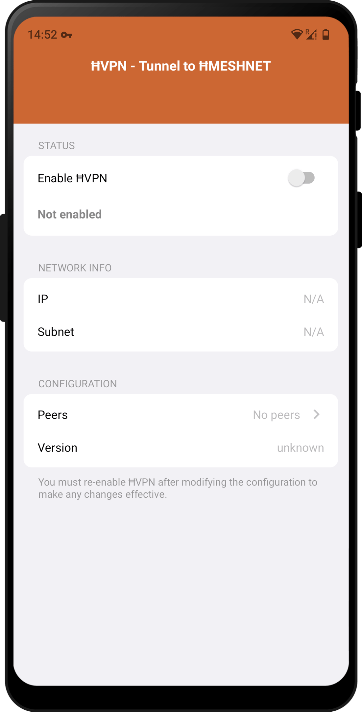
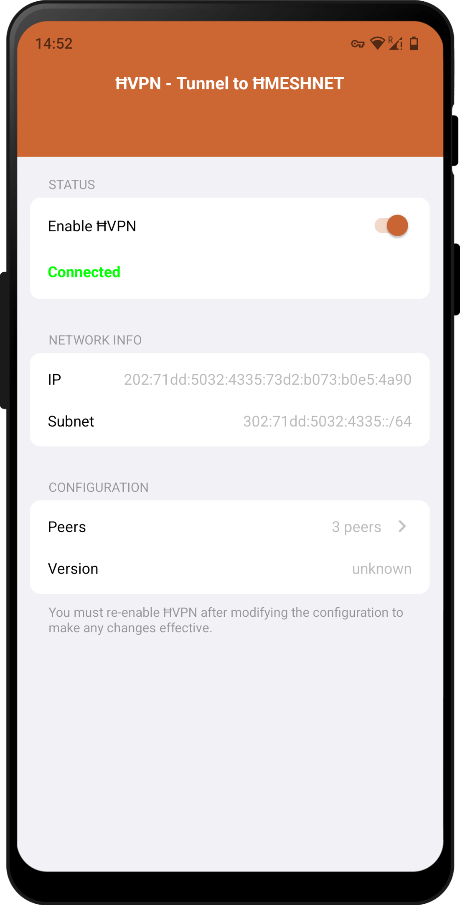

# ĦVPN

Unser privater IPv6-Tunnel durch das Internet mit Ein-Klick-Aktivierung zum Schutz Ihrer Verbindung von ĦWallet und ĦCommunicator zum HydraMeshnet. Seine Aktivierung ist eine Voraussetzung für die Nutzung aller anderen ĦApps.

 


## Installation

### Android
Getestet mit folgenden Android-Versionen:
- Android 7, 8, 9, 10, 11, 12, 13, 14, 15

Getestet mit der folgenden Hardware:
- Google
- Samsung
- Realme C21-Y
- Ulefone Armor 7

Für Ihre Android-Geräte, laden Sie die APK herunter und erlauben Sie die Installation.


## Quelle / Basierend auf Yggdrasil

Yggdrasil Android
-----------------

Yggdrasil ist eine frühe Implementierung eines vollständig Ende-zu-Ende-verschlüsselten IPv6-Netzwerks. Es ist leichtgewichtig, selbstorganisierend, wird auf mehreren Plattformen unterstützt und erlaubt so ziemlich jeder IPv6-fähigen Anwendung, sicher mit anderen Yggdrasil-Knoten zu kommunizieren. Yggdrasil erfordert keine IPv6-Internetverbindung - es funktioniert auch über IPv4.

Mit dieser Anwendung können Sie sich mit dem Yggdrasil-Netzwerk verbinden und jeden Dienst nutzen, der sich in diesem Netzwerk befindet. Es funktioniert wie ein VPN-Dienst, aber Ihr gesamter Datenverkehr läuft über Ihren Provider und nicht über das Yggdrasil-Netzwerk.

Es ist auch nicht das Ziel des Yggdrasil-Projekts, Anonymität zu bieten. Direkte Peers über das Internet werden in der Lage sein, Ihre IP-Adresse zu sehen und könnten diese Information nutzen, um Ihren Standort oder Ihre Identität zu bestimmen. Multicast-entdeckte Peerings im selben Netzwerk werden normalerweise Ihre Geräte-MAC-Adresse aufdecken. Andere Knoten im Netzwerk können möglicherweise einige Informationen darüber erkennen, mit welchen Knoten Sie gepeert werden.

Der gesamte über das Yggdrasil-Netzwerk gesendete Datenverkehr wird Ende-zu-Ende verschlüsselt. Unter der Annahme, dass unsere Verschlüsselung solide ist, kann er von keinem Zwischenknoten entschlüsselt oder gelesen werden und kann nur von dem Empfänger entschlüsselt werden, für den er bestimmt ist. Bitte beachten Sie jedoch, dass Yggdrasil nicht offiziell extern geprüft wurde.

## Download

[](https://f-droid.org/packages/eu.neilalexander.yggdrasil/)

Or get the APK from the [Releases Section](https://github.com/yggdrasil-network/yggdrasil-android/releases/latest).

## Build Instructions

* install gomobile

```bash
go install golang.org/x/mobile/cmd/gomobile@latest
```

* build yggdrasil-go for android:

```
git clone https://github.com/yggdrasil-network/yggdrasil-go /tmp/yggdrasil-go
cd /tmp/yggdrasil-go
./contrib/mobile/build -a
```

* clone yggdrasil for android and copy over the built go library

```
git clone https://github.com/yggdrasil-network/yggdrasil-android /tmp/yggdrasil-android
mkdir /tmp/yggdrasil-android/app/libs
cp /tmp/yggdrasil-go/yggdrasil.aar /tmp/yggdrasil-android/app/libs/
```

* build yggdrasil-android

```
cd /tmp/yggdrasil-android
./gradlew assembleRelease
```

note: you will need to use jdk-11 as jdk-16 `"doesn't work" ™`

on debian/ubuntu you can set which jdk used with the `JAVA_HOME` env var:
```
export JAVA_HOME=/usr/lib/jvm/java-11-openjdk-amd64/
```
